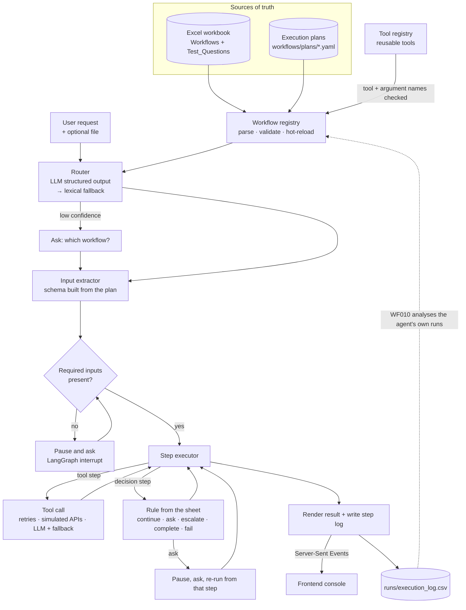
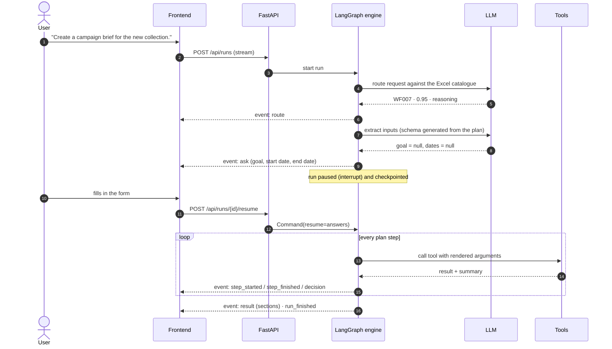

<div align="center">

# Flowline · workbook-to-workforce

**Turn business workflows written in an Excel workbook into a working AI agent.**

Write a workflow as a row in a spreadsheet. Flowline reads it, works out which workflow a plain-English request needs, runs the steps with real tools, applies the sheet's rules, asks a person when something is missing, and streams every step to a live UI.


</div>

---

## Contents

- [What it does](#what-it-does)
- [Why it is built this way](#why-it-is-built-this-way)
- [Build progress](#build-progress)
- [Architecture](#architecture)
- [How a request flows](#how-a-request-flows)
- [The spreadsheet is the source of truth](#the-spreadsheet-is-the-source-of-truth)
- [Workflow selection](#workflow-selection)
- [Execution and tool calling](#execution-and-tool-calling)
- [Conditions, human-in-the-loop and error handling](#conditions-human-in-the-loop-and-error-handling)
- [The 10 workflows](#the-10-workflows)
- [Adding an 11th workflow](#adding-an-11th-workflow)
- [Design decisions](#design-decisions)
- [Repository layout](#repository-layout)
- [Getting started](#getting-started)
- [Configuration](#configuration)
- [Testing](#testing)
- [Assumptions](#assumptions)
- [Beyond this assignment](#beyond-this-assignment)

---

## What it does

```text
User      ▸ "Check today's inventory and identify products that need restocking."

Selected  ▸ WF001 · Inventory Restock Check                      confidence 97%
Steps     ▸ ✓ Load inventory                       load_table        Excel step 1
            ✓ Compare current stock with minimum   compute_column    Excel step 2
            ✓ Apply restock rule                   flag_rows         Excel step 3
            ◆ Any products below threshold?        decision → continue
            ✓ Calculate reorder quantity           compute_column    Excel step 4
            ✓ Generate restock list                sort_rows         Excel step 5
Result    ▸ 6 products need restocking  (table · CSV download)
            KN-2001 is exactly at its minimum → not flagged (rule is strictly "<")
```

**A single generic agent runs every workflow.** There are no per-workflow chatbots and no `if workflow == "WF001"` branches. Each Excel row is paired with a short, validated **execution plan**, and one engine interprets all of them using a shared **tool library**.

### Highlights

| | |
|---|---|
| **Excel-driven** | Workflow IDs, names, triggers, steps, rules and test questions are read from the workbook at runtime. Thresholds such as "exceeds 10%" are parsed from the sheet's own text, so edit the cell and the behaviour changes. |
| **Zero-code extension** | A new workflow is one Excel row plus one plan file. The LLM can draft that plan from the row and the tool catalogue. |
| **Human-in-the-loop** | When required information is missing, the run *pauses*, asks a typed question (date pickers, choices, file upload) and *resumes the same run*. It does not start over. |
| **Never invents data** | Missing product attributes are reported, not made up. Tracking numbers are never guessed. LLM outputs are constrained to enums and vocabularies, then checked. |
| **Exact where it matters** | The LLM handles language. Arithmetic and rules run in plain Python, so a 10.00% difference is never mistaken for 10.01%. |
| **Resilient** | Simulated external APIs with latency and fault injection, retries with exponential backoff, an LLM circuit breaker, and deterministic fallbacks for every LLM step. |
| **Observable** | Every routing decision, input, tool call, retry and rule outcome streams live to the UI. Every run is logged step by step, and one workflow (WF010) reports on those logs. |
| **Works offline** | No API key? Routing, extraction and content fall back to deterministic logic, and everything still runs end to end. |

---

## Why it is built this way

The brief asks for agents that *understand a request, select the right workflow, execute its steps, handle conditions and errors, and return the result*. It also says adding an 11th workflow should need minimal code changes.

Two simpler designs both fall short:

1. **One prompt per workflow.** Ten hard-coded chatbots. It doesn't scale, and the Excel file becomes documentation instead of the system.
2. **A free-form ReAct agent that picks tools as it goes.** It's flexible, but runs aren't repeatable, are hard to audit against the sheet, are slow, and can't be trusted with arithmetic.

Flowline sits between them. **The spreadsheet says *what*, a small declarative plan says *how*, and one engine runs any plan.** The LLM does the parts that need language understanding: picking the workflow, reading inputs, writing content, classifying, and drafting new plans. Deterministic code does the parts that need to be exact.

---

## Build progress

This repository is built incrementally. The commit history follows the order below.

- [x] Project scaffold: separate `backend/` and `frontend/`, dependencies, central settings
- [x] Seeded sample business data with planted edge cases
- [x] Spec layer: read the Excel workbook, typed models, plan validation, hot reload
- [ ] Tool library and provider-agnostic LLM client with offline fallback
- [ ] Engine: router, input extraction, LangGraph executor, result rendering, run log
- [ ] Execution plans for WF001–WF010
- [ ] Streaming HTTP API and command-line interface
- [ ] Live execution console (frontend)
- [ ] Test suite covering every workflow and edge case
- [ ] WF011 example: extension with zero code changes

---

## Architecture



| Layer | Module | Responsibility |
|---|---|---|
| **Spec** | `flowline/spec/` | Parse the workbook with tolerant header matching, split steps on `→`, attach test questions, join each row with its plan, validate everything, resolve rule parameters from the Excel text, hot-reload on change |
| **Expressions** | `flowline/expr.py` | Safely evaluate rules (`current_stock < minimum_stock`) and templates (`"{{ len(rows) }} products"`) without `eval`, so plans cannot execute code |
| **Tools** | `flowline/tools/` | Reusable, typed functions: load and clean tables, join, flag, aggregate, fuzzy lookup, duplicate grouping, LLM generate/classify/map/extract, text validation |
| **LLM** | `flowline/llm/` | One interface over OpenAI, Gemini, Groq and Anthropic using structured output, with a circuit breaker |
| **Engine** | `flowline/engine/` | Router, input extractor, the LangGraph state machine, result rendering, run logging |
| **API** | `flowline/api/` | FastAPI service that streams each run as Server-Sent Events, plus file upload and download endpoints |
| **Frontend** | `frontend/` | Static HTML/CSS/JS console (no build step) that renders the event stream live |

---

## How a request flows



---

## The spreadsheet is the source of truth

Each row of the `Workflows` sheet is parsed into a typed `WorkflowSpec`:

| Excel column | Becomes |
|---|---|
| `Workflow_ID`, `Workflow_Name`, `Trigger` | identity and routing catalogue |
| `Inputs` | what the extractor looks for |
| `Steps` (split on `→`) | the steps every plan step must point back to |
| `Decision_Logic` | rule parameters, read with a regex (e.g. `exceeds (\d+)%` → `10`) |
| `Tools_Required`, `Expected_Output` | shown in the UI and used for routing |
| `Test_Questions` sheet | routing examples, UI suggestions and test cases |

A plan binds each Excel step to a tool. Here is a shortened example:

```yaml
workflow_id: WF002
params:
  threshold_pct:
    default: 10
    from_excel: '(\d+(?:\.\d+)?)\s*%'        # read from Decision_Logic: "...exceeds 10%"
steps:
  - id: match
    title: Match products by SKU
    excel_step: 2
    tool: join_tables
    args: {left: $products, right: $vendor, left_on: sku, right_on: vendor_sku, normalize: sku}
    output: match
  - id: flag
    title: Flag exceptions
    excel_step: 5
    tool: flag_rows
    args: {table: $compared, when: "abs_pct > params.threshold_pct", flag: exception}
    output: compared
```

**Validation happens when plans load**, before anything runs. It catches unknown tools, misspelled arguments, missing required arguments, jumps to steps that don't exist, questions about unknown inputs, and **any Excel step no plan step implements**. A broken plan disables only its own workflow, and the error names the file, step and argument.

---

## Workflow selection

- **LLM router.** The prompt is built from the Excel rows at request time, so a new row is routable immediately. The model returns `{workflow_id, confidence, reasoning, alternatives}` as structured output, validated against the real IDs.
- **Lexical fallback.** If there's no key or the LLM fails, a BM25-style scorer runs over the same Excel text. Its confidence combines how much of the request it covers, how strong the match is, and **how far ahead it is of the runner-up**.
- **Clarification.** Below a configurable confidence (default 55%), the agent shows its top candidates and asks which one you meant. If nothing matches, it says so.

---

## Execution and tool calling

- **Inputs.** The LLM fills a schema generated from the plan's input definitions, with the instruction *"null when not stated"*. Plan regexes fill any gaps. Attached files go to the plan's file inputs.
- **Tools.** Arguments are rendered from the run context (`$inventory`, `{{ inputs.category }}`) and checked against each tool's Python signature.
- **Simulated APIs.** Order, shipment and directory lookups have realistic latency and optional fault injection. Transient faults are retried with exponential backoff, visibly.
- **The LLM is constrained.** Intent labels are restricted to the four allowed values. Skills must come from the employee directory's vocabulary. Generated copy is checked for length limits and for invented attributes.

---

## Conditions, human-in-the-loop and error handling

| Situation | Behaviour |
|---|---|
| Rule from `Decision_Logic` | A decision step: `continue` · `complete` · `ask` · `escalate` · `fail` · `goto`. The UI shows the expression and its outcome. |
| Required input missing | The run pauses, asks with a typed form, and resumes the **same** run |
| Problem found mid-run (order not found, unknown product, end date before start) | Ask the user, then re-run from the step that needs the answer |
| Transient API failure | Retry with exponential backoff, then fail cleanly with the reason |
| LLM unavailable, bad key or timeout | Deterministic fallback for that call. A circuit breaker skips the LLM for 60s after repeated failures |
| Bad input (missing file, unsupported type, no SKU column) | Clear, user-facing failure on the step that hit it |
| Unexpected tool exception | Contained to its step and reported; the service keeps running |

---

## The 10 workflows

| ID | Workflow | Excel rule → implementation | Edge cases covered |
|---|---|---|---|
| WF001 | Inventory Restock Check | `current_stock < minimum_stock`, strict | stock **equal** to minimum is not flagged; out of stock; no max stock; category, product or threshold from the request |
| WF002 | Product Price Validation | flag when the difference **exceeds** 10% (read from Excel) | SKU format drift (`ts1001` = `TS-1001`); exactly ±10.00% not flagged; unmatched SKUs on both sides |
| WF003 | Vendor File Processing | rows missing SKU or name are invalid | messy headers, blank rows, `N/A` and `$29.99` values, duplicate SKUs reported as warnings |
| WF004 | Product Description Generator | do not invent missing attributes | asks for the product; unknown product → asks for its category; missing attributes listed and checked absent from the copy |
| WF005 | Customer Order Status | no order found → ask for another identifier | invalid format; not found; email with several orders; no tracking yet (never guessed) |
| WF006 | Duplicate Product Detection | exact SKU = definite; high similarity = possible | case/space SKU variants; reworded names; size or colour **variants** are not duplicates |
| WF007 | Marketing Campaign Brief | goal or dates missing → request them first | the test question has neither, so it asks before generating; end date before start date; "new collection" resolved from the data |
| WF008 | SEO Keyword Classification | exactly four intents | duplicates; inline keyword lists; category mapping; priority scoring; target page per intent |
| WF009 | Employee Task Assignment | prefer skills + capacity; escalate if nobody fits | best match on leave; skilled but overloaded; capacity limited by deadline; unknown skills |
| WF010 | Workflow Performance Report | flag failure rate > 10% or slow average time | combines 30 days of history with **the agent's own live runs** |

---

## Adding an 11th workflow

1. Add a row to the `Workflows` sheet, for example `WF011 · Low Margin Alert · … · Flag products whose gross margin is below 62%`.
2. Add `backend/workflows/plans/WF011.yaml` using existing tools, or let the LLM draft it:
   `python -m flowline compile WF011`. The draft is validated, repaired once if needed, and kept as `.draft` until a person reviews it.
3. Reload. The workflow is routable and runnable, and **no Python changes were made**.

A new **tool** is needed only for a capability the library doesn't have yet. That's one decorated function.

---

## Design decisions

| Decision | Reasoning |
|---|---|
| Declarative plans + one generic engine | Repeatable, auditable runs that map 1:1 to the spreadsheet, while staying generic |
| LangGraph | A real state machine with checkpointing, `interrupt()` / `Command(resume=…)` for human-in-the-loop, and custom event streaming |
| LLM for language, Python for math | Thresholds, percentages and rankings must be exact and testable |
| Parameters parsed from the sheet | The business owns the rules; the code doesn't hard-code them |
| Safe expression language (`simpleeval`) | Rules live in YAML without `eval`, so even an LLM-drafted plan cannot run code |
| Structured output (function calling) | Every LLM answer is validated against a schema generated at runtime |
| Provider-agnostic + offline mode | Switching provider is a config change; reviewers can run it with no key; outages degrade gracefully |
| Separate backend and frontend | Clear contract (HTTP + SSE), each side runs and scales on its own |
| Server-Sent Events | One-way, ordered, live progress over plain HTTP, simpler than WebSockets for this use |
| Self-logging | The engine writes the same log format WF010 analyses |

---

## Repository layout

```
workbook-to-workforce/
├── backend/
│   ├── flowline/
│   │   ├── config.py          settings from .env, LLM provider selection
│   │   ├── expr.py            safe expressions and templates
│   │   ├── spec/              Excel parsing, plan models, validation
│   │   ├── tools/             reusable tool library
│   │   ├── llm/               provider-agnostic client
│   │   ├── engine/            router, extractor, LangGraph executor, rendering, run log
│   │   └── api/               FastAPI streaming service
│   ├── workflows/
│   │   ├── AI_Agent_Workflow_Assessment_1.xlsx   source of truth
│   │   └── plans/             one execution plan per workflow
│   ├── data/                  simulated business data
│   ├── scripts/               data generator, example runner
│   ├── tests/
│   ├── requirements.txt
│   └── .env.example
└── frontend/
    ├── index.html
    ├── styles.css
    └── app.js
```

---

## Getting started

**Requirements:** Python 3.10+ and Git. No Node.js needed.

### Backend

```bash
cd backend
python -m venv .venv
# Windows: .venv\Scripts\activate      macOS/Linux: source .venv/bin/activate
pip install -r requirements.txt
cp .env.example .env            # Windows: copy .env.example .env  — then add an API key (optional)
python scripts/generate_data.py # sample data (already committed; re-run to reset)
python -m flowline serve        # API on http://127.0.0.1:8000
```

### Frontend

In a second terminal:

```bash
cd frontend
python -m http.server 5500      # or VS Code "Live Server"
```

Open **http://localhost:5500**.

### Command line

```bash
python -m flowline run "Where is order ORD-1001?"   # run one request in the terminal
python -m flowline validate                          # check the workbook and every plan
python -m flowline tools                             # list the tool library
python -m flowline compile WF011                     # draft a plan for a new Excel row
```

---

## Configuration

All settings live in `backend/.env` (see `.env.example`).

| Variable | Default | Purpose |
|---|---|---|
| `LLM_PROVIDER` | `auto` | `auto` uses the first provider with a key; `offline` disables the LLM; or `openai`, `google_genai`, `groq`, `anthropic` |
| `LLM_MODEL` | per provider | Override the model |
| `OPENAI_API_KEY` / `GOOGLE_API_KEY` / `GROQ_API_KEY` / `ANTHROPIC_API_KEY` | – | Provider credentials |
| `WORKFLOW_FILE` | `workflows/AI_Agent_Workflow_Assessment_1.xlsx` | The workbook to load |
| `ROUTER_MIN_CONFIDENCE` | `0.55` | Below this, the agent asks which workflow was meant |
| `SIM_API_LATENCY_MS` | `250` | Latency of simulated external APIs |
| `SIM_FAULT_RATE` | `0` | Probability of a simulated API fault (the UI can set this per run) |
| `CORS_ORIGINS` | `http://localhost:5500,…` | Frontend addresses allowed to call the API |

---

## Testing

```bash
cd backend
pytest
```

The suite runs offline, deterministically and quickly. It covers:

- every Excel test question, end to end
- the edge cases planted in the sample data
- routing on paraphrases, out-of-scope and ambiguous requests
- pause/resume flows
- retries and failures
- the LLM code paths, using a fake model
- the HTTP API
- adding an 11th workflow with no code changes

---

## Assumptions

Where the workbook is open to interpretation, the choice is explicit:

- **WF001.** "Minimum stock threshold" means each product's `minimum_stock`; a request can override it. Reorder quantity is `max_stock − current_stock`; when `max_stock` is missing, it is `2 × minimum − current`.
- **WF002.** The percentage difference is relative to the internal price, rounded to two decimals, and flagged only when it *exceeds* the threshold.
- **WF003.** Only a missing SKU or name makes a row invalid. Other problems are reported as warnings and the row is kept.
- **WF006.** "Exact SKU match" ignores case, spaces and punctuation. Products that differ only by size or colour are variants, not duplicates.
- **WF007.** "Dates" means a start date and an end date. Nothing is generated until both dates and the goal are known.
- **WF009.** With no estimate, the candidate needs a minimum number of free hours for the task's priority. With a deadline, only hours before the deadline count. Nobody on leave is assigned.
- **WF010.** The sheet's "defined threshold" for execution time defaults to 4 seconds and is configurable.

---

## Beyond this assignment

Next steps for production use:

- A persistent checkpointer (Postgres or Redis), so paused runs survive restarts
- Real connectors in place of the simulated APIs
- Authentication and per-user history
- Token and cost metrics in WF010
- An evaluation set for the LLM router

---

<div align="center">

Built by **Keshav Sharma** · [github.com/keshav301104](https://github.com/keshav301104)

</div>